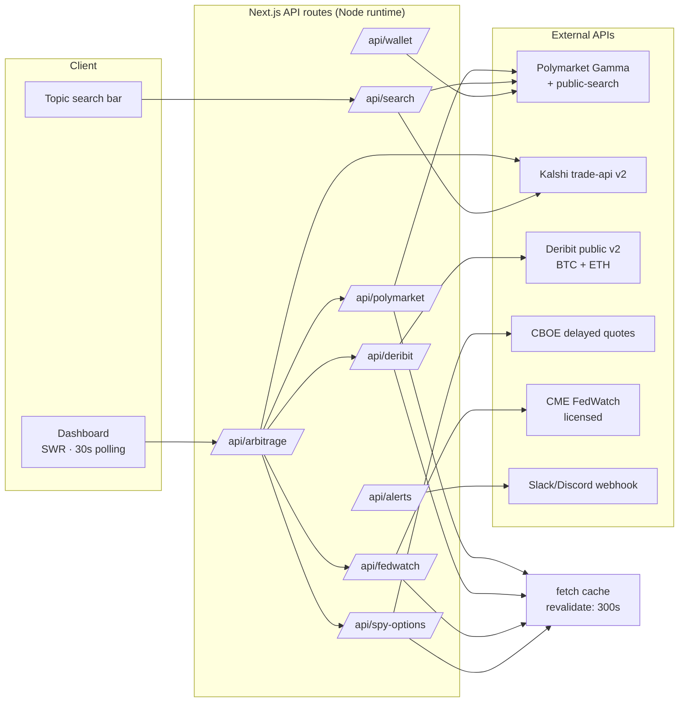

# WallStreet-v-PolyMarket

**Cross-Market Probability Arbitrage Dashboard** — a Next.js + TypeScript trading terminal that answers one question: *where do prediction markets and traditional finance disagree on the same event?*

> Compares Polymarket prediction-market probabilities against a Black–Scholes-derived "Wall Street" probability for the same binary event (Fed decisions, BTC thresholds, SPX levels, election markets).

Each row compares a Polymarket price against a "Wall Street" probability for the same binary event and exposes the gap as a spread (`polymarketYes − wallStreet`, percentage points). Spreads past ±10pp flag as potential pricing inefficiencies — the kind of dislocation a cross-venue arbitrageur hunts for.

The Wall Street leg is built two ways:

- **Options-implied probabilities** — Black–Scholes binary-call probability `e^{-rT}·N(d2)` computed over live Deribit options chains (BTC + ETH) and CBOE delayed SPY quotes (SPX proxy). A prediction market is literally a binary option, so this is the principled comparison.
- **Cross-venue prices** — Kalshi, the other regulated prediction market, as the second leg for Fed, sports, politics, geopolitics, and culture markets where no options equivalent exists. Polymarket vs Kalshi is genuine venue arbitrage.

Every leg carries a venue tag (`via Polymarket` / `via Kalshi` / `via Deribit` / `via CBOE`), so provenance is always visible — and anything that can't be priced honestly is labeled demo rather than faked.

**Live demo:** https://wallstreet-v-polymarket.vercel.app

## What this is for — and why

Prediction markets and derivatives markets price the *same* uncertainty independently, on different venues, with different participants and collateral. When they disagree beyond a threshold, one side is mispriced — the textbook definition of a cross-market arbitrage signal. This dashboard surfaces those disagreements in real time: crowd-implied probability (Polymarket, Kalshi) vs. options-implied probability (Deribit, CBOE) vs. futures-implied rates (CME FedWatch).

Use it as a screening tool: a +10pp spread on "BTC above $90k" means the prediction market crowd is far more bullish than option traders paying for the same payoff — an opportunity to buy the cheap leg or a flag that the venues are pricing different contracts.

**Why it signals quant competence:** the project isn't a data dashboard glued onto APIs — it implements the actual machinery a derivatives desk uses. Black–Scholes binary-call pricing `e^{-rT}·N(d2)` to convert option IVs into event probabilities, risk-neutral valuation, IV-as-sigma bridging between continuous (options) and discrete (prediction-market) payoffs, cross-venue fuzzy contract matching (the real-world problem of knowing two markets are "the same event"), mark-to-market portfolio tracking, and honest data-provenance labeling — the same disciplines behind statistical arbitrage, vol trading, and market-microstructure work. It demonstrates fluency in the exact vocabulary of quant / risk / systematic-trading-adjacent engineering roles, built end-to-end as a production-grade Next.js system.

## Feature tour

- **Cross-market spreads table** — the top 15 highest-volume live markets across 8 categories (Fed, BTC, SPX, politics, sports, crypto, geopolitics, culture), each with Polymarket %, Kalshi %, Wall Street % (options-implied), spread, live/resolved status, 7-day sparkline, and trade signal. Category filters, event search, and demo-leg visibility toggle.
- **Free-text topic search** — search anything tradable ("tesla", "pope", "lakers"). Queries Polymarket's server-side search and pages Kalshi's open events for token matches; each leg renders its real price or an explicit *no market* when a venue doesn't list the topic. Resolved markets (the ones pinned at ~0%/100%) are tagged **Resolved** and sorted below live, tradable markets.
- **Portfolio** — manual entry, CSV import, or paste a `0x…` Polymarket proxy wallet to pull real positions (read-only public API). Positions mark-to-market against the live feed and persist in localStorage.
- **Analytics** — spread distribution + position P&L charts (Recharts), driven by your actual positions.
- **History & activity** — every add/close/import lands in a persistent activity log rendered on the dashboard and `/history`.
- **Spread alerts** — optional Slack/Discord webhook fires once per event per day when a spread crosses ±10pp.
- **Trading-terminal UI** — dark-first theme (light toggle), mono numerics, green/red P&L semantics, sidebar nav.
- **Honest Demo/Live toggle** — demo mode is a deterministic dataset for offline preview; live mode shows per-row which legs are real vs. demo and can hide demo legs entirely.

## Architecture



`/api/arbitrage` fans out to all sources, tags each market into a category via keyword matching, computes the Wall Street leg (options math for price markets, Kalshi twins elsewhere), keeps the top 15 rows by Polymarket 24h volume, and emits `{event, category, polymarketPct, kalshiPct, wallStreetPct, wallStreetSource, spread, status, volume, sparkline, isSignificant, stale}`. The Black–Scholes `N(d2)` uses a hand-rolled Abramowitz–Stegun `erf` — zero math dependencies, verified by Vitest.

## Tech stack

Next.js 16 (App Router, Turbopack) · React 19 · TypeScript strict · Tailwind CSS v4 · SWR · Recharts · Vitest · Deployed on Vercel

## Running the project

```bash
git clone https://github.com/Prad-Nanduri/WallStreet-v-PolyMarket.git
cd WallStreet-v-PolyMarket
npm install
npm run dev          # http://localhost:3000

npx vitest run       # Black–Scholes unit tests
npm run lint
npm run build
```

No env vars required — every source falls back to demo data and the UI labels it honestly.

### Optional env vars (`.env.example`)

| Variable | Effect |
| --- | --- |
| `CME_FEDWATCH_API_KEY` | Licensed CME FedWatch access — enables real rate-probability data for the Fed leg |
| `ALERT_WEBHOOK_URL` | Slack or Discord incoming webhook for ±10pp spread alerts |
| `UPSTASH_REDIS_REST_URL` + `UPSTASH_REDIS_REST_TOKEN` | Reserved for real historical spread persistence (sparklines stay simulated without it) |

Users with FedWatch access can also paste per-meeting probabilities on `/settings` as a manual override — no redeploy needed.

## API reference

| Route | Source | Returns |
| --- | --- | --- |
| `GET /api/arbitrage` | Aggregator | Top-15-by-volume spread rows joining Polymarket, Kalshi, and options-derived probabilities, with live/resolved status |
| `GET /api/search?q=…` | Polymarket + Kalshi + Deribit + CBOE | Free-text market search; each leg is a real price or `null` ("no market"), resolved markets flagged |
| `GET /api/polymarket` | Polymarket Gamma | Top-volume markets, categorized, paginated ≤ 2,000 |
| `GET /api/deribit` | Deribit v2 | BTC/ETH spot, nearest-strike mark IV, DVOL fallback |
| `GET /api/fedwatch` | CME FedWatch | Rate probabilities — demo unless `CME_FEDWATCH_API_KEY` or manual override |
| `GET /api/spy-options` | CBOE delayed quotes | SPY spot + IV30 implied vol (live); demo on failure |
| `GET /api/wallet?wallet=0x…` | Polymarket data-api | Public proxy-wallet positions, read-only |
| `POST /api/alerts` | Slack/Discord | `{sent}` — rate-limited once/event/day |
| `POST /api/revalidate` | — | Drops the shared 5-minute `arb-data` cache |

## Engineering notes

- **Why Kalshi**: FedWatch is licensed data with no free alternative (the public CME settlements endpoint IP-blocks datacenter traffic; FRED doesn't host ZQ futures prices). Rather than fabricate a Fed leg, Kalshi provides a *real* counter-venue price — and Fed/politics/sports rows become true cross-venue arbitrage.
- **Conservative matching**: Kalshi twin matching requires high token-overlap similarity; ambiguous pairs get no leg rather than a wrong one.
- **Honest significance**: `isSignificant` requires *both* legs live — a demo leg can never fake a 10pp signal or spam alerts.
- **Deterministic demo mode**: seeded PRNG data so screenshots/tests are reproducible.
- **Client-side portfolio**: no auth, no DB — positions live in localStorage, so the app is a pure static-hosting deploy.

## Known limitations

- **SPX ≈ SPY × 10** — spot and IV30 scaled from CBOE's free delayed feed; dividends/settlement differ from real SPX options.
- **CME FedWatch is demo by default** — needs a market-data license (`CME_FEDWATCH_API_KEY`) or the manual Settings override.
- **Sparkline history is simulated** — deterministic seeded walk until `UPSTASH_*` persistence is configured.
- **Unmatched politics rows use a 50% prior** — no options equivalent; rows show `via 50% prior` and never flag significant.
- **Alert rate-limiting is in-memory** — resets on restart; fine for a single instance.
- **Portfolio is client-side only** — clearing site data removes positions; event matching is fuzzy.

## References

- [Polymarket Gamma API](https://docs.polymarket.com) — market metadata, implied probabilities, public search
- [Kalshi trade API](https://docs.kalshi.com) — events and market prices
- [Deribit API](https://docs.deribit.com) — options chain, mark IV, DVOL
- [CME FedWatch](https://www.cmegroup.com/markets/interest-rates/cme-fedwatch-tool.html) — FOMC rate probabilities (licensed)
- Black & Scholes (1973) — risk-neutral binary probability `e^{-rT}·N(d2)`

Built by [Prad Nanduri](https://github.com/Prad-Nanduri).
